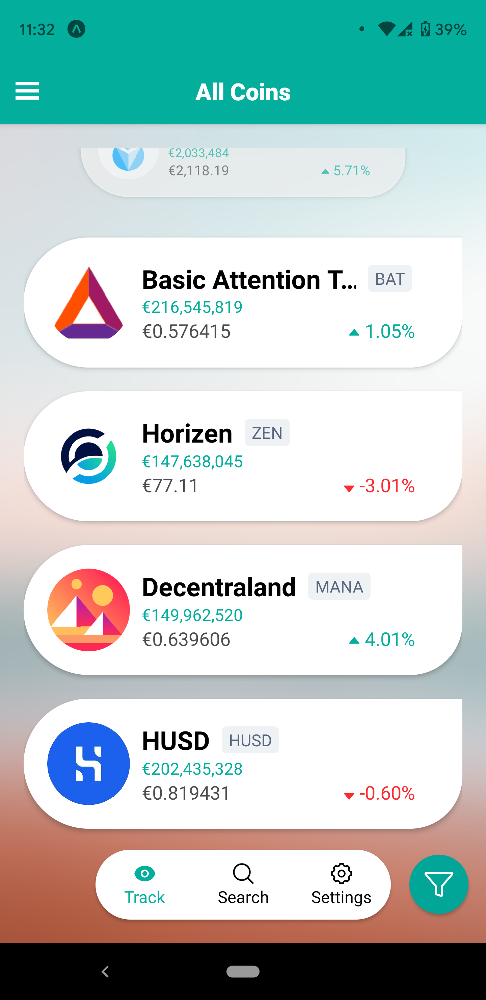
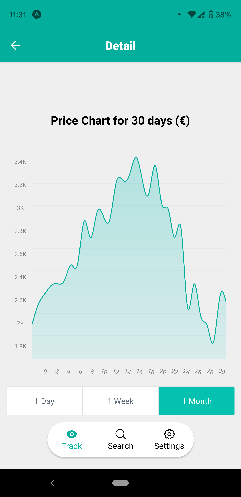

# Crypto Tracker App

A Crypto Tracker App built using React Native, utilizing [CoinMarketCap API](https://coinmarketcap.com/api/documentation/v1/#tag/exchange) to track the price of cryptocurrencies.
## User Stories

- [ ] The user can request the list of cryptocurrencies from the CoinMarketCap API and see the results collated together.
- [ ] Progressively load more list items by scrolling down the list.
- [ ] The user can sort the cryptocurrencies based on their name, price, and volume.

## App Details

### Screenshots

| Splash Screen | Prices by Market Cap  | Detail Screen |
| :-:  | :-: | :-: |
| **WIP** |  |  |

### Installation

WIP
### Loading Environment Variables

```
API_URL=https://pro-api.coinmarketcap.com
CMC_API_KEY=
PORT=8051
```

## Useful links and resources
- [Why I’ve built a Coinmarketcap proxy](https://medium.com/@theBliz/why-ive-built-a-coinmarketcap-proxy-e06c898b5765)
- [Infinite scroll/Paginating FlatList with just hooks and function components](https://medium.com/@srbkrishnan/infinite-scroll-pagination-in-flatlist-with-hooks-and-function-components-c9c08bba23a8)
- [React Native Scroll Item animation effect - FlatList and Animated API](https://www.youtube.com/watch?v=F8x-dyIsrJ8)
- [CryptoTracker](https://github.com/SpiralDevelopment/CryptoTracker)